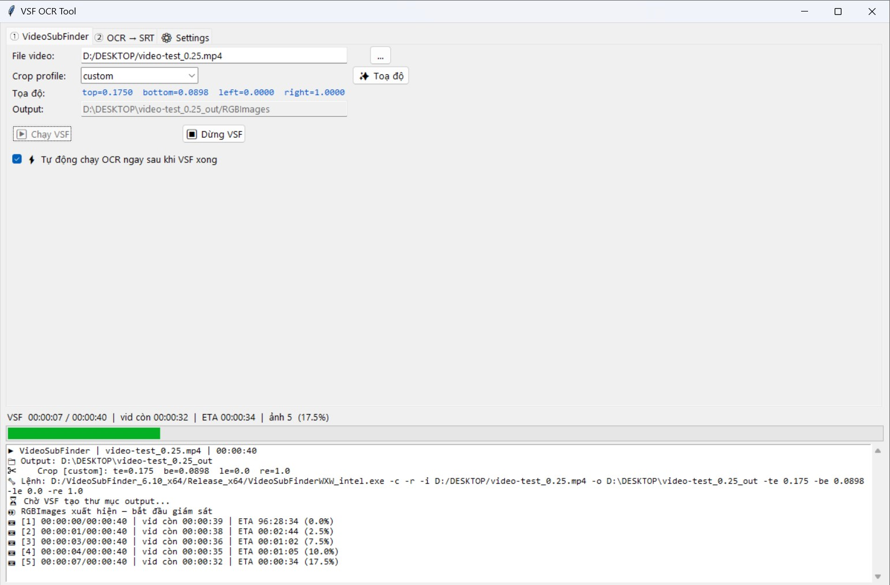
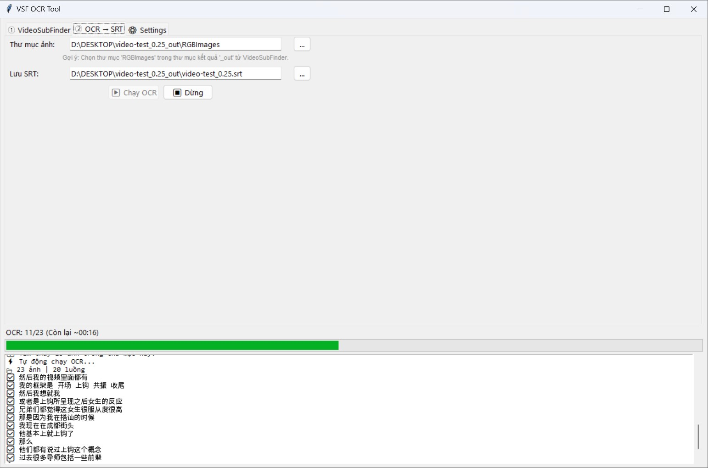

# AutoVSF - VideoSubFinder & OCR Pipeline

**[Tiếng Việt](docs/VIE_README.md)** | **[中文](docs/CN_README.md)**

Extract hardcoded subtitles from videos using VideoSubFinder and OCR via Google Drive API.

---

## Quick Install (One-Click)

Open **PowerShell** (as Admin) and paste:

```powershell
irm https://raw.githubusercontent.com/lionc2240/autovsf/main/install.ps1 | iex
```

After installation, type `autovsf` in **any** PowerShell window to launch the tool. The installer registers a global PowerShell function for quick access.

---

## Screenshots

<p align="center">
  
</p>

<p align="center">
  
</p>

---

## Manual Setup

### 1. Requirements
- Python ≥ 3.10: `pip install watchdog google-api-python-client oauth2client httplib2 opencv-python psutil Pillow`
- VideoSubFinder 6.10 (x64): Extract into `program/` so the executable is at:
  `program/VideoSubFinder_6.10_x64/Release_x64/VideoSubFinderWXW_intel.exe`

### 2. Google Cloud Setup (Required for OCR)
Configure Google Drive API and place `credentials.json` in the project root.
> See [Google Cloud Setup Guide](docs/GOOGLE_SETUP.md)

### 3. Run

- **PowerShell (anywhere):** After installing via the one-click script, just type:
  ```powershell
  autovsf
  ```

- **Windows:** Double-click `run.bat` or run:
  ```batch
  run.bat
  ```

- **Directly with Python:**
  ```powershell
  python main.py
  ```

---

## Features
- **Tab 1 (VSF):** Run VideoSubFinder to extract subtitle images. Drag-and-drop Crop Profile builder.
- **Tab 2 (OCR):** Auto-upload images to Google Drive OCR, assemble into `.srt` files with real-time ETA.
- **Tab 3 (Settings):** Flexible configuration, smart `credentials.json` management.

---

## Important Notes
- On first OCR run, the browser will open for Google login. Use the Google Cloud account you configured.
- Make sure to **Publish App** (Production) under "Audience" in Google Cloud Console to avoid auth errors.
